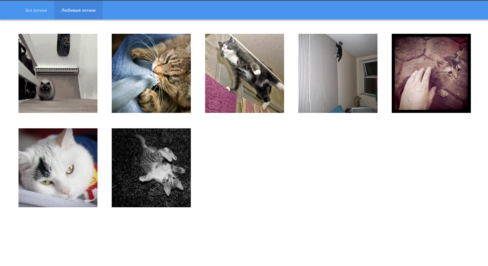

# Cat Pinterest

[Live Preview](https://vikagovorina.github.io/frontend-challenge/)

## Описание

В рамках проекта разработано SPA-приложение для просмотра изображений котиков с возможностью добавления в избранное. Приложение реализует поведение, аналогичное Pinterest: бесконечная прокрутка, интерактивные карточки и адаптивный интерфейс.

## Функционал

- Просмотр списка изображений котиков с использованием внешнего API
- Бесконечная прокрутка с подгрузкой данных при скролле
- Добавление и удаление котиков в избранное
- Сохранение избранных котиков в localStorage
- Синхронизация состояния между страницами
- Разделение на страницы: “Все котики”, “Любимые котики”
- Плавная загрузка изображений
- Адаптивный интерфейс

## Стек

- React
- TypeScript
- MobX
- React Router
- Intersection Observer API
- CSS Modules
- LocalStorage
- TheCatAPI
- Axios

## Установка

```bash
git clone https://github.com/VikaGovorina/frontend-challenge.git
npm install
```

## Переменные окружения

Создайте файл `.env` на основе `.env.default` и укажите API ключ:

VITE_CAT_API_KEY=your_api_key

## Запуск

```bash
npm run dev
```



